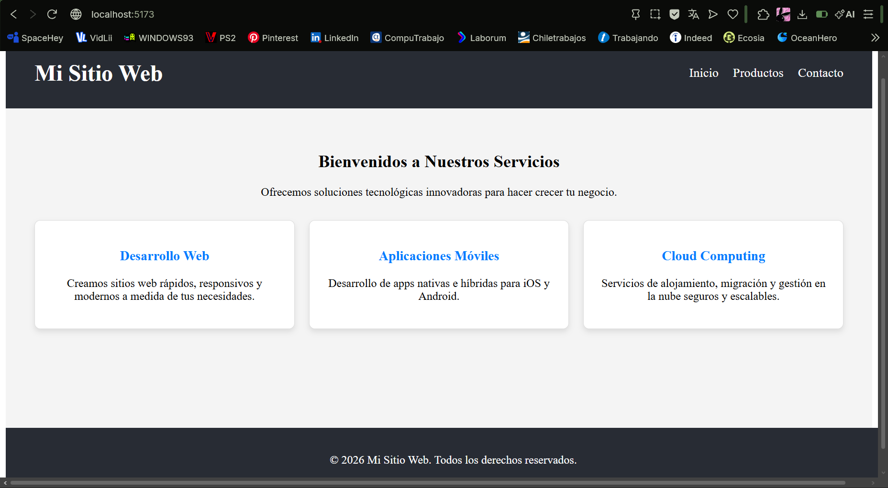

# Actividad Práctica: Componentes básicos en React

**Nombre del estudiante:** Antonia Avila
**Nombre de la actividad:** Componentes básicos en React

## Descripción del proyecto
Página web sencilla desarrollada con React utilizando componentes funcionales independientes (Header, Main, Footer). El proyecto aplica estilos básicos mediante archivos CSS separados y se integran en un archivo principal (App.jsx), cumpliendo con las restricciones de no usar librerías externas ni Hooks.

## Instrucciones para ejecutar el proyecto
1. Clonar el repositorio.
2. Abrir una terminal en la carpeta del proyecto.
3. Ejecutar el comando `npm install` para instalar las dependencias.
4. Ejecutar el comando `npm run dev` para levantar el servidor de desarrollo.
5. Abrir el enlace local proporcionado (usualmente http://localhost:5173/) en el navegador.

## Captura de pantalla

## Preguntas de Reflexión
* **¿Qué es un componente en React?** 
Es una pieza de código modular, reutilizable e independiente que representa una parte de la interfaz de usuario.

* **¿Qué función cumple App.jsx?** 
Es el componente principal o "raíz" de la aplicación donde se integran y organizan todos los demás subcomponentes (como Header, Main y Footer) para renderizar la página completa.

* **¿Para qué se utiliza import?** 
Sirve para traer y utilizar módulos, componentes, librerías o archivos (como hojas de estilo CSS) que fueron definidos en otros archivos.

* **¿Para qué se utiliza export default?** 
Se utiliza para exportar un único elemento desde un archivo, de modo que pueda ser importado fácilmente en otros archivos del proyecto.

* **¿Qué función cumple JSX?** 
Es una extensión de sintaxis para JavaScript que permite escribir código similar a HTML dentro de los archivos de React, facilitando la creación de la estructura visual.

* **¿Por qué separamos los estilos CSS de los componentes?** 
Para mantener un código limpio, ordenado y modular, lo que facilita el mantenimiento y escalabilidad del proyecto.

* **¿Qué ventaja tiene dividir una página en componentes?** 
Permite la reutilización de código, facilita el trabajo en equipo, simplifica la búsqueda de errores y hace que la aplicación sea más fácil de mantener.

* **¿Qué diferencia existe entre Header, Main y Footer?** 
Cumplen diferentes roles semánticos: Header suele contener la navegación, Main encapsula el contenido principal de la página, y Footer contiene la información de cierre o derechos de autor.
